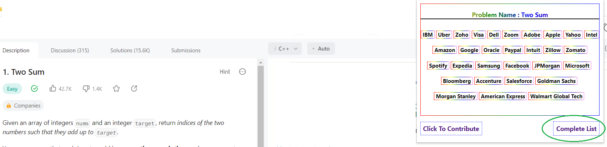

# LeetCode Which Company

## This extension gives you the information of the companies who asked a certain question in the technical interview.
------ 
  
### **1. Activate on Google Chrome browser**
To activate this extension on your Google Chrome browser.

Download the chrome version **[LeetCode Which Company.zip](https://github.com/ssavi-ict/LC-Which-Company/raw/main/chrome/LC-Which-Company-chrome-1.0.2.zip)**. 
-----
1. Extract the downloaded ZIP file
2. On your `Google Chrome` browser, go to `Extensions`.
3. Turn On `Developer Mode`.
4. Click `Load Unpacked`.
5. Show the following path `<directory_path>/LC-Which-Company/manifest.json` located on your PC.
----
  
### **2. Activate on Mozila Firefox browser**

1. Go to this link - https://addons.mozilla.org/en-US/firefox/addon/leetcode-for-company/

2. Install it using **Add to Firefox**.

---
### **3. How to check which company asked a Problem ?**
When solving a problem if you click on the  from the *extensions* / *add ons* list -

1. If the extension is able find the `Company Names` for the leetcode problem on the current window then it will show as follows - 

💥 NEW FEATURE 💥
- Once you click on the **[Complete List]** button it will open up a page where you can see all the problems available in our storage with company names are listed. [all_list](/chrome/res/complete_list.png)

2. If the extension is not able to find the `Company Names` for the leetcode problem on the current window or if the current window is not a leetcode problem then it will show as follows - 

3. If the extension is clicked on a `non-leetcode` site then it will show as follows - 

-----
  

# CONTRIBUTIONS
We appreciate your intention towards contributing in this repository. 

This extension is a small effort for all the LeetCode non-premium users who wants to have the company informations while solving a leetcode problem. 

We would request someone having **Chrome Developer** account contact *ssavi.ict@gmail.com* to publish this extension on chrome web store

Currently we are accepting only the `Company Contributions` to enrich the company database. To contribute please follow the instructions of this issue [[CONTRIBUTE] Dear Contributors, Requesting Your Attention Regarding Company Contribution](https://github.com/ssavi-ict/LC-Which-Company/issues/4).

----
 

**Note**: Works currently with `Google Chrome` and `Mozilla Firefox`. Hopefully, I will be able to update this for all other major browsers.

**Special Thanks** to **B M Marjan Khan** [@marjankhan945](https://github.com/marjankhan945) for his emmense contribution, support and suggestions towards working on this project.

Read the background about how I started working on this in [LC Which Company - A Company names retrieval extension](https://sites.google.com/view/iamavik/leetcode-which-company-a-company-names-retrieval-extension).
